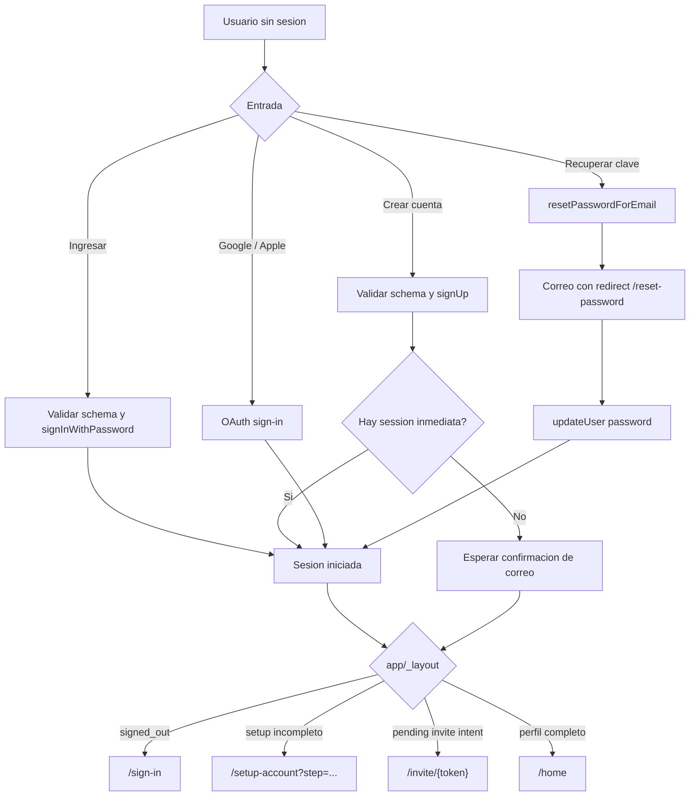
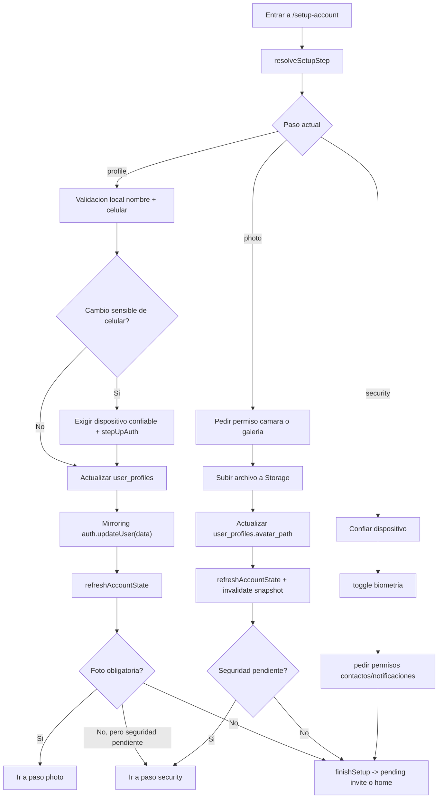
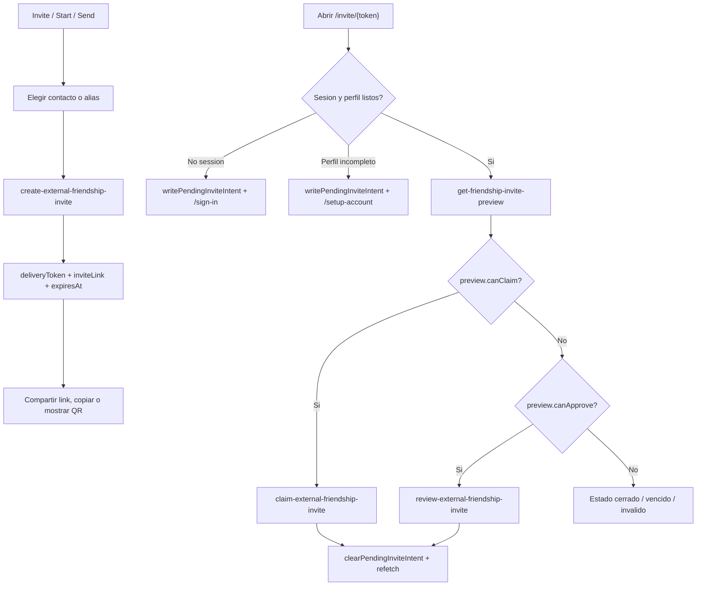
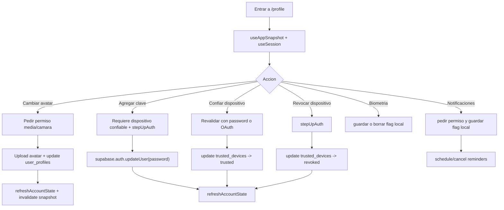
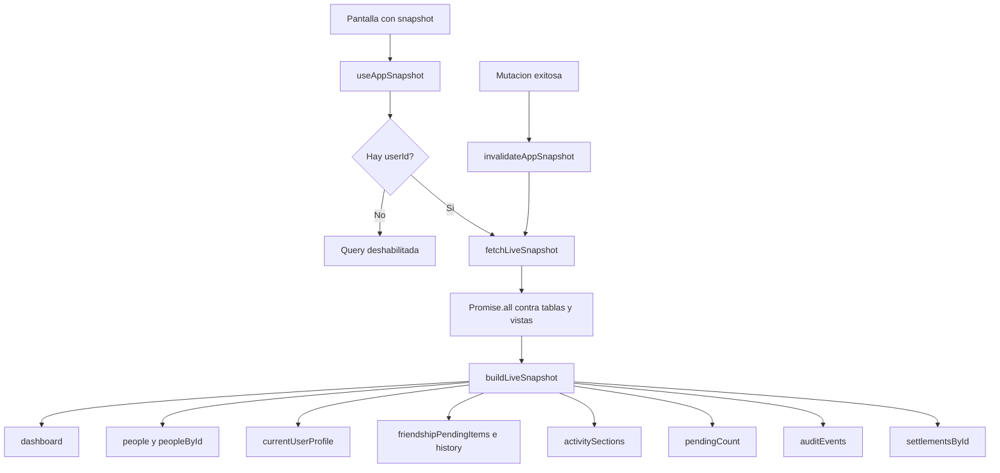

# System Flows

Estas secuencias no viven en Figma. Son la capa tecnica que sostiene las pantallas del archivo `APP-HOUSE`.

## Auth y route gating

Hechos del codigo:

- `signInWithPassword` valida con `emailPasswordSignInSchema` y usa `supabase.auth.signInWithPassword`.
- `registerAccount` valida con `registrationSchema` y usa `supabase.auth.signUp` con redirect a `/setup-account?step=profile`.
- `requestPasswordReset` usa `supabase.auth.resetPasswordForEmail` con redirect a `/reset-password`.
- `updatePassword` requiere una recovery session valida y usa `supabase.auth.updateUser`.
- [app/_layout.tsx](C:/Users/Samuel/Documents/Happy_circles/apps/mobile/app/_layout.tsx) fuerza el gate de signed out, setup incompleto y pending invite intent.

Errores y bloqueos visibles:

- correo o clave invalidos
- enlace de recuperacion vencido
- SMTP / rate limit de Supabase
- recovery session faltante

## Onboarding y setup account

Hechos del codigo:

- `resolveSetupStep` decide entre `profile`, `photo` y `security` usando pasos pendientes y seguridad pendiente.
- `completeProfile` escribe en `user_profiles` y luego hace mirror a `supabase.auth.updateUser({ data })`.
- `useUpdateProfileAvatarMutation` sube imagen al bucket de avatar y persiste `avatar_path`.
- `finishSetup` redirige a un pending invite si existe; si no, manda a `/home`.
- `requestContactsPermission` y `requestNotificationsPermission` actualizan estado local de permisos.

Errores y bloqueos visibles:

- nombre o celular invalidos
- cambio de celular sin dispositivo confiable
- fallo de camara o galeria
- fallo al subir avatar
- permisos denegados

## Invite remoto y claim/review

Hechos del codigo:

- `InvitePersonScreen` usa `useCreateExternalFriendshipInviteMutation`.
- La mutacion invoca la Edge Function `create-external-friendship-invite` con `idempotencyKey`.
- `InviteLinkScreen` guarda `pendingInviteIntent` si la persona esta signed out o con setup incompleto.
- `useFriendshipInvitePreviewQuery` llama `get-friendship-invite-preview`.
- `useClaimExternalFriendshipInviteMutation` llama `claim-external-friendship-invite`.
- `useReviewExternalFriendshipInviteMutation` llama `review-external-friendship-invite`.

Errores y bloqueos visibles:

- contacto sin numero valido
- permiso de contactos o camara denegado
- token vencido o revocado
- invitacion ya conectada o reclamada por otra cuenta
- identidad incompleta para reclamar

## Profile y seguridad

Hechos del codigo:

- `ProfileScreen` mezcla estado de `useSession` con `useAppSnapshot`.
- `attachEmailPassword` solo funciona desde dispositivo confiable y despues de `stepUpAuth`.
- `trustCurrentDevice` actualiza `trusted_devices` a `trusted`.
- `revokeTrustedDevice` actualiza `trusted_devices` a `revoked`.
- `setBiometricsEnabled` usa almacenamiento local y biometric auth del dispositivo.
- Las notificaciones activas pueden programar o cancelar recordatorios diarios.

Errores y bloqueos visibles:

- dispositivo no confiable
- biometria no disponible o no enrolada
- reautenticacion abre otra cuenta
- camara o media sin permiso

## Home data loading

Hechos del codigo:

- `useAppSnapshot` solo se habilita con `userId`.
- `fetchLiveSnapshot` lee en paralelo:
  - `user_profiles`
  - `v_friendship_invites_live`
  - `v_friendship_invite_deliveries_live`
  - `relationships`
  - `v_open_debts`
  - `financial_requests`
  - `v_relationship_history`
  - `v_inbox_items`
  - `settlement_proposals`
  - `settlement_proposal_participants`
  - `audit_events`
- Las mutaciones invalidan el snapshot despues de escribir.

Errores y bloqueos visibles:

- sesion expirada o JWT invalido
- falla de cualquier query agregada
- datos incompletos durante estado de hidratacion
